# [KMC Projects](https://kmc-projects-686d2f98b9c9.herokuapp.com/ "KMC Projects deployed site")

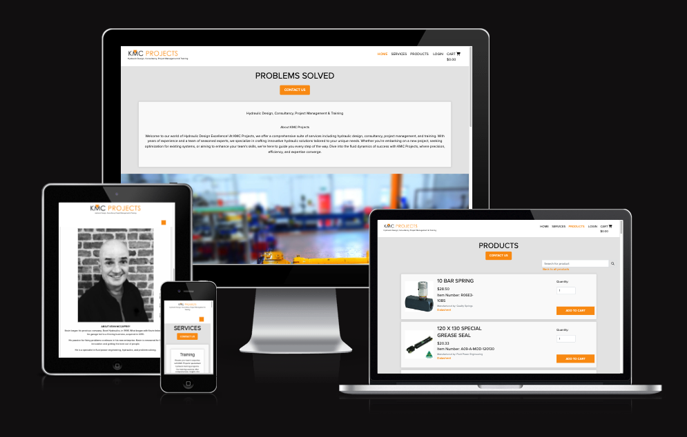

# Introduction
- [Live Site Link](https://kmc-projects-686d2f98b9c9.herokuapp.com/ "KMC Projects deployed site")

KMC Projects is a real world business founded by Kevin McCaffrey. The site has been created to showcase the work and services that KMC Projects provides, offer an easy contact for clients to get in touch, and a database of products that KMC Projects distributes that clients can purchase. 

KMC Projects offers a comprehensive range of services tailored to meet the diverse needs of commercial companies in the hydraulic industry. From hydraulic design and consultancy to project management and training, they are dedicated to delivering innovative solutions that ensure precision, efficiency, and success.

They provide a distribution list of hydraulic products. Whether you're sourcing components for a new project or replacing parts in existing systems, their inventory ensures that you have access to top-quality products that meet your requirements.

Throughout this README both KMC Projects and Kevin McCaffrey will often be referred to as 'the client'.

## Table of Contents

- [Key Project Goals](#key-project-goals)
- [Business Model](#business-model)
    - [Target Audience](#target-audience)
- [Agile Development](#agile-development)
- [User Stories](#user-stories)
    - [Future Stories](#future-stories)
- [Web Marketing](#web-marketing)
    - [SEO Implementation](#seo-implementation)
- [User Experience](#user-experience)
    - [Wireframes](#wireframes)
    - [Database Schema](#database-schema)
    - [Typography](#typographt)
    - [Colour Palette](#colour-palette)
    - [Logo](#logo)
- [Features](#features)
    - [Existing Features](#existing-features)
    - [Future Features](#future-features)
- [Technologies Used](#technologies-used)
- [Testing](#testing)
- [Deployment](#deployment)
    - [Cloning The Repository](#cloning-the-repository)
    - [Deploying on GitHub Pages](#deploying-on-github-pages)
    - [The SQL Database]()
- [Credits](#credits)
    - [Content](#credits)
    - [Images](#images)
    - [Education](#education)
- [Acknowledgements](#acknowledgements)

# Key Project Goals

The main goal of the site is to offer a one-stop-shop for clients of KMC Projects. This main goal can be split into smaller goals, they include
- Being able to be able to contact KMC Projects and enquire about working with them.
- See what kind of services KMC Projects offer
- Read about case studies to see they type of work they can provide
- Purchase parts from the distribution products list
- Login and see their order histroy 

# Business Model

The business model is both a business-to-customer and business-to-business as they work both with individual professionsals, companies and clients.
For business to customer, the site provides a list of products to purchase, the customer can do this without being a client of KMC Projects and can purchase as a one off item.
For business to business, the site provides business a contact form to get in touch with KMC project in order to work with them from their list of services or ask for a bespoke offering. Businesses can also purchase from the prodcuts page.
Both businesses and customers can create a login in order to see their purchase histroy. 

When speaking with Kevin from KMC Projects he said this business model worked well for them as it allowed a range of people to come and see what they can do. This is called a [Business to Many](https://en.wikipedia.org/wiki/Business_to_many#:~:text=With%20both%20B2B%20and%20B2C,more%20quickly%20on%20the%20market. "Business to many wikipedia") or B2M

## Target Audience

KMC Projects target audience focus on the hydraulic industry, businesses involved in construction, manufacturing, infrastructure development, and related sectors. Their clients often know what they need before coming to the site.
The audience main goals are to
- Contact KMC Project
- Find parts they are already looking for (using part number, or sometimes part name)

# Agile Development

A Kaban board was used in GitHub to create the agile development process – see the board [here](https://github.com/sarahgoodwin93/kmc-projects/projects?query=is%3Aopen Kaban Board)

There were 4 projects created

- Generic User (Guest)

- Regisered User

- Admin User

- Shopper

To represent the 4 different access areas of the site. 
User stories were labelled using the MoSCoW method.

[Back to Top](#kmc-projects)

# User Stories

The user stories are as follows:

## User Stories

### Generic User (Guest):
- As a guest user, I can browse through the services offered by KMC Projects so that I can understand the scope of the company's expertise.
- As a guest user, I can view case studies on past projects completed by KMC Projects so that I can assess the quality of their work.
- As a guest user, I can access the site's product list to explore the range of products offered by KMC Projects.
- As a guest user, I can access the site's content to learn about the company's mission, values, and team member.
- As a guest user, I can sign up to the newsletter to keep up to date with the company's latest news and updates.
- As a guest user, I can use the contact form to get in touch with KMC Projects.
- As a guest user I can view a list of the items for purchase so that select which items I wish to add to my cart.

### Registered (Logged in) User:
- As a logged-in user, I can create and manage my account profile on KMC Projects so that I can personalize my experience on the site.
- As a site user I can login so that I can see my account information and be able to logout.
- As a logged-in user, I can view my order history from past orders
- As a logged-in user, I can update my delivery information to save for future orders

### Admin User:
- As an admin user, I can add new services to the offerings provided by KMC Projects
- As an admin user I can edit the services so that I can make updates to the services information 
- As an admin user, I can create case studies showcasing successful projects completed by KMC Projects.
- As an admin user I can edit the case study so that I can make updates to the case study information
- As an admin user I can view a list of the contacts that have used the contact us form so that easily get back to them about upcoming business requests

### Shopper:
- As a shopper, I can search for specific products or services offered by KMC Projects to find what I need efficiently.
- As a shopper, I can add items to my cart and proceed to checkout seamlessly on KMC Projects.
- As a shopper, I can save my delivery information 
- As a shopper, I can add item to my cart so that I can review them before purchase

## Future Stories

### Registered (Logged in) User:
- As a future registered user, I would be able to see my contact form responses and make amends to them

### Admin User:
- As a future admin user, I would be able to view a list of the newsletter signsups without going to the django admin panel
- As a future admin user, I would be able to edit the products list page without going to the django admin panel

### Shopper:
- As a future shopper, I would be able to request certain parts be made available 
- As a future shopper, I would be notified if a new product was made available 

# Web Marketing

For this project the following web marketing strategies were used:

- SEO and content marketing
- Social media marketing
- Email newsletter subscription

## SEO Implementation

To implement SEO in this project, various techniques were used. These include using semantic HTML, avoiding excessive keyword repetition, integrating keywords naturally within website content, incorporating metadata descriptions and keywords at the head level of the project, and using the 'noopener' attribute in the 'rel' tag. External links have descriptive 'aria-label' attributes for enhanced accessibility.

The keywords are short-tailed and long-tailed and are as follows:

Short-tailed Keywords:
 - Hydraulic Design
 - Consultancy
 - Project Management
 - Training
 - Problem-solving
 - Fluid power
 - Engineering
 - Hydraulic Solutions

Long-tailed Keywords:
- Hydraulic Design Excellence
- Hydraulic Consultancy Services
- Project Management for Hydraulic Systems
- Hydraulic Training Programs
- Innovative Hydraulic Solutions
- Precision Hydraulic Engineering
- Efficient Hydraulic Systems
- Expert Hydraulic Engineers
- Hydraulic Product Distribution List
- Quality Hydraulic Products for Purchase

A robots.txt file is included at the project's root level. This file instructs search engine crawlers about the URLs they can access on the website. Its primary purpose is to prevent the site from being overwhelmed by excessive requests. It's important to note that robots.txt isn't intended to exclude web pages from Google; rather, it serves as a tool for managing crawler access.

The project's root level also includes a sitemap.xml file. This file serves as a catalog of a website's crucial pages, ensuring that Google can locate and index them effectively. It aids search engines in comprehending the structure of your website. It's crucial for Google to index all significant pages of your website. However, certain pages may lack internal links, making them challenging for search engines to discover. A sitemap can expedite the process of content discovery in such cases.

## Social Media Marketing

Facebook was used as the primary social media platform for web marketing due to its extensive user base and broad demographic reach. The objective of establishing a Facebook business page is to attract the attention of potential customers and to showcase the company's products and services effectively. A real business facebook account was created and at the time of submission was active it can be found here [KMC Projects Facebook](https://www.facebook.com/profile.php?id=61558802589438 "KMC Project Facebook page")

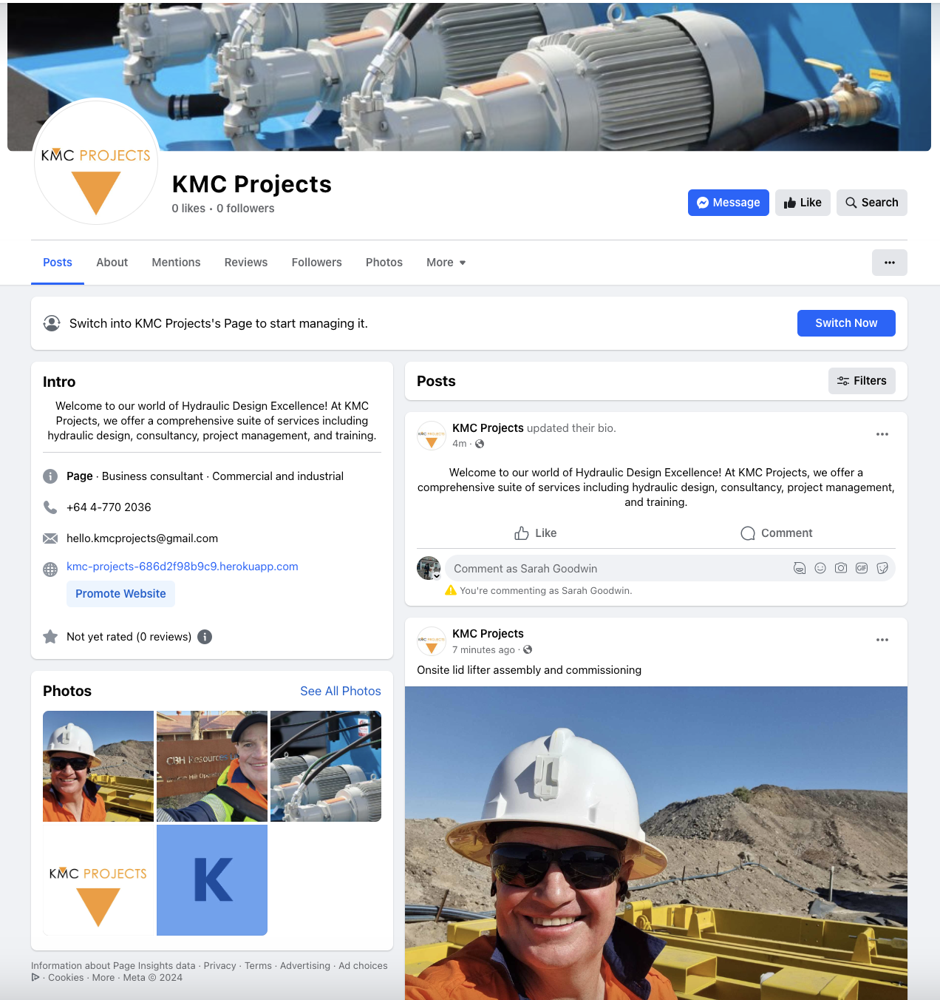

# User Experience

## Wireframes

Wireframes were created for each different page type, Home, Services, Products and Forms.
The Products wireframe was used as a base to create the cart & checkout pages.
The forms wireframe was used as a base to create the login, logout, sign up, contact us and newsletter pages.
This was done to keep consistancy across the site. 

Wireframe can be down in these drop downs:

 Wireframe Home

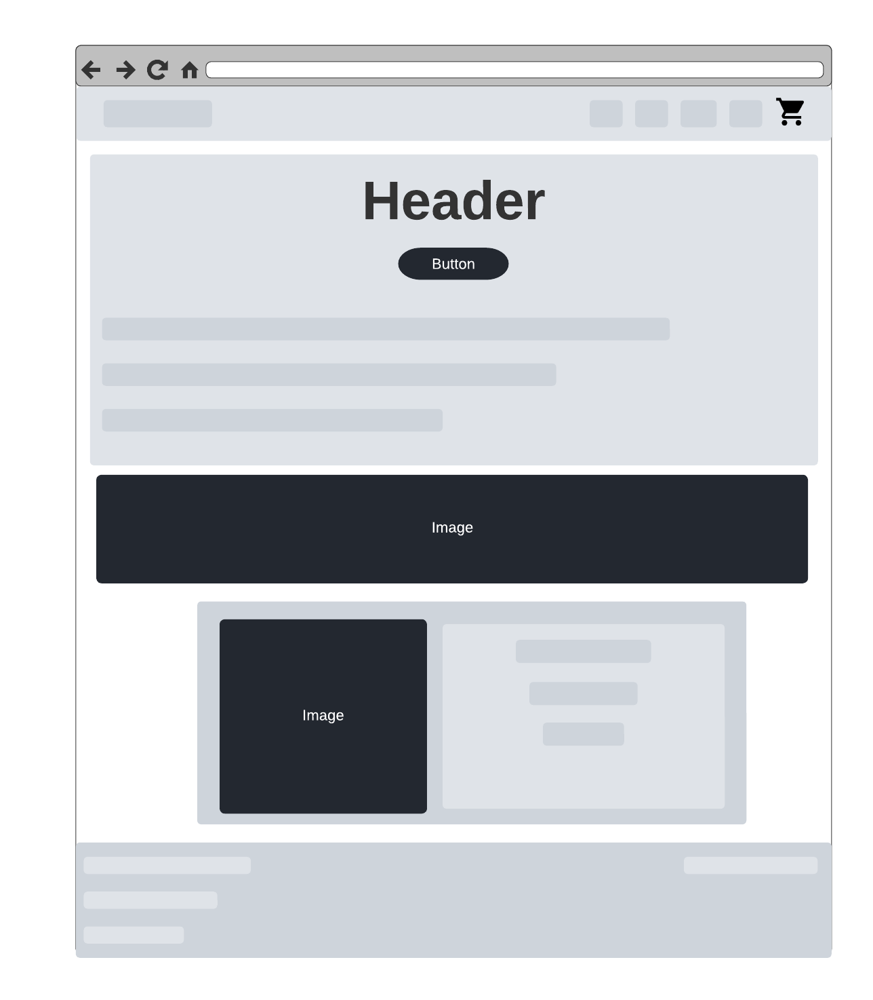

 Wireframe Services

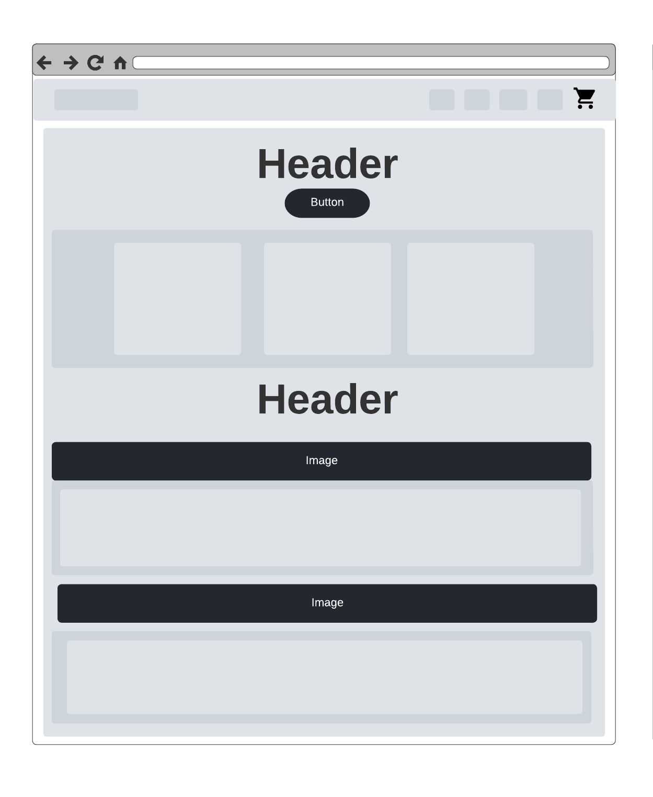

 Wireframe Items

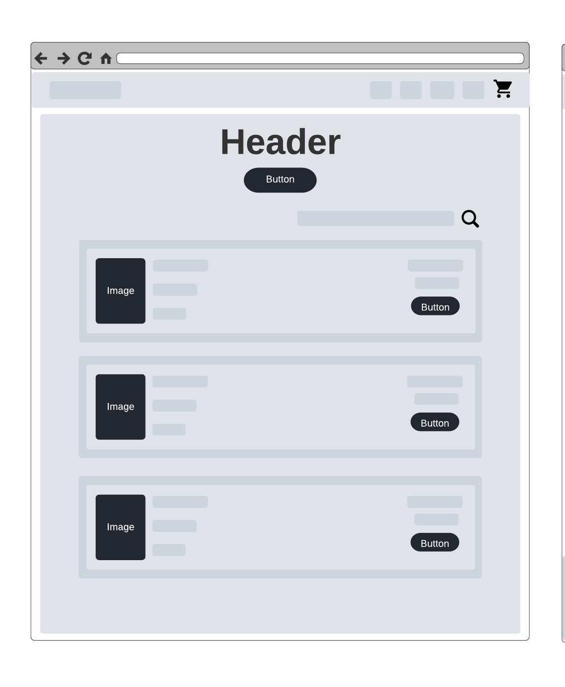

 Wireframe Forms

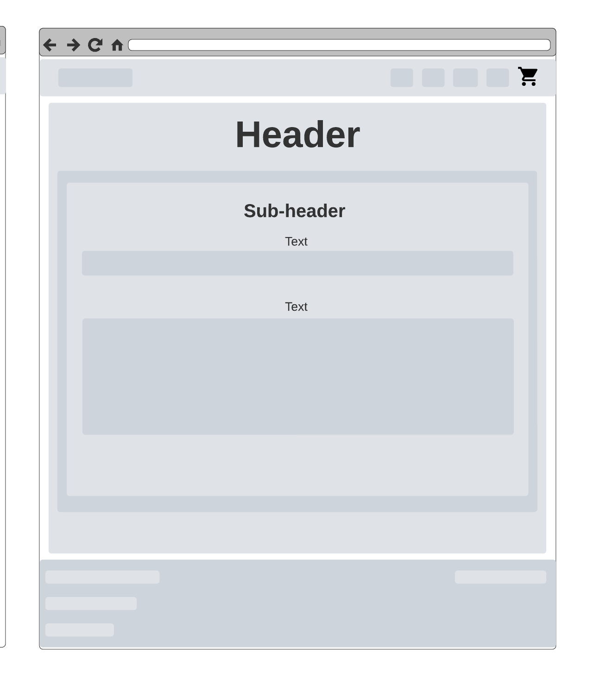

## Database Schema

The data schema was created using [drawSQL](https://drawsql.app/ "drawsql website homepage") before the project was started to get the flow and function of the models.
Some of the fields in the below images do not reflect the final data types used – please see the app for the true data types.

There are 4 custom models in this project
- The Services Model (full CRUD)
- The CaseStudy Model (full CRUD)
- The Contact Model
- The NewsLetterSignUp Model

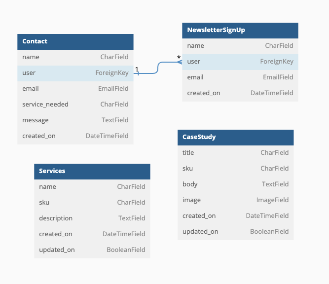

There are also  models that have been amended from the Boutique Ado Walkthrough to fit the requirements of the site
- The Item Model (based on the Products model)
- The Order Model (based on the Order model)
- The OrderLineItem Model (based on the OrderLineItem model)
- The UserDetials (based on the UserProfile model)

A full data schema was used using `django-extensions` > `pydot` > `python manage.py graph_models -a > all_models.dot` visualising the dot file with [GraphvizOnline](https://dreampuf.github.io/GraphvizOnline/ "GraphvizOnline website")

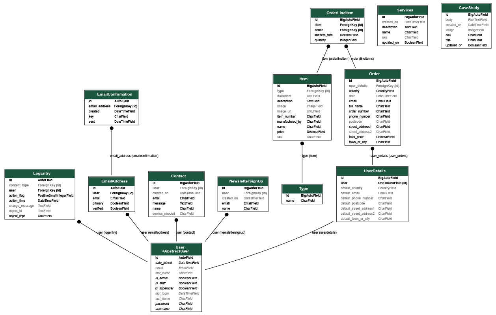

## Typography

Proxima Nova was chosen from Adobe Fonts for its clean and elegant design. It is characterized by its rounded strokes and subtle variations in stroke width, giving it a warm and friendly appearance. As the client wanted a clean, minimal and industral look, proxima nova seemed like a perfect fit. 
It suits well with the logo that was already created for the business.  

## Colour Palette

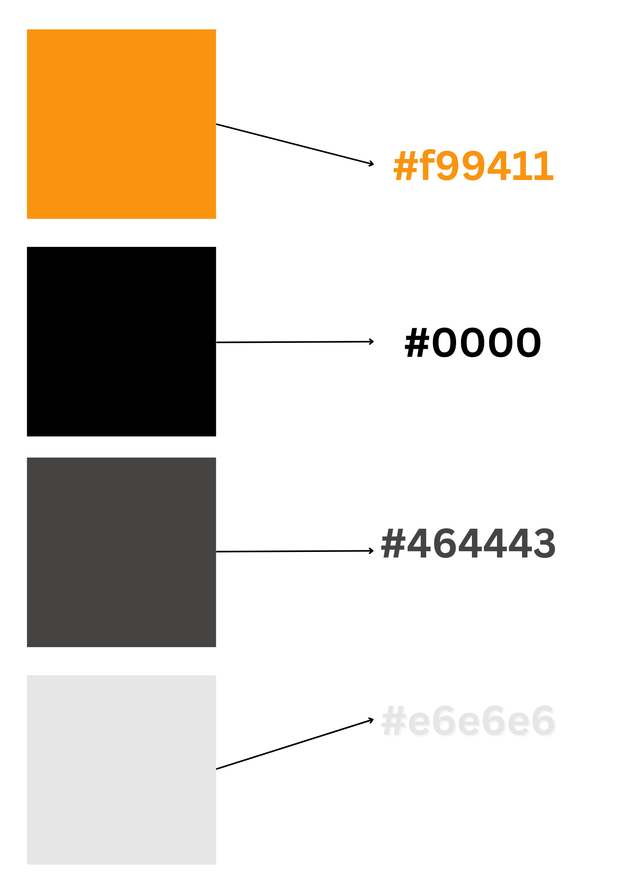

KMCs hero colour is #f99411, this was taken from their logo which was designed in by [JayKay Art](https://www.jay-kay.co/ "link to jaykay art homepage")

The colour pallet was craeted using the logo and the clients instructions to keep the site minimual and clean.
Different shades of grey were chosen to make the orange stand out and provide a nice contrast while keeping the look industral. 

The colour pallette also allows images added to the site to stand out.

### Logo

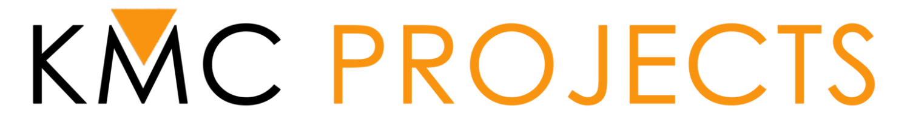

The logo was designed in by [JayKay Art](https://www.jay-kay.co/ "link to jaykay art homepage") and was already a part of the KMC Project business. It was the only design assets the client provided and much of the sites looks and feel came from inspriation of the logo. 

Under the logo the tagline 'Hydraulic Design, Consultancy, Project Management & Training' clearly states the key services of the business and the two are often found together.

The favicon is taken from the logo itself.

[Back to Top](#kmc-projects)

# Features

## Existing Features

### Home

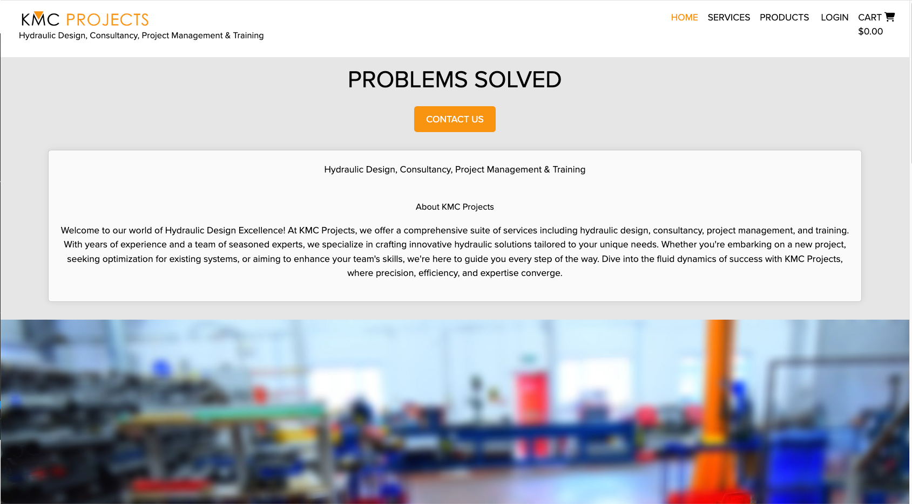

The homepage clearly shows the logo, the tag line, the company values and gives easy access to the nav bar. 
It provides access to one of the sites main functions for contacting KMC Projects and gives the user knowledge they have landed in the right place by showing 'Problems Solved', one of KMC mottos. 

The homepage shows a bright image of hydraulic cyclinders giving users another visual sense of the site.
The homepage is responsive on all screen sizes.

#### About

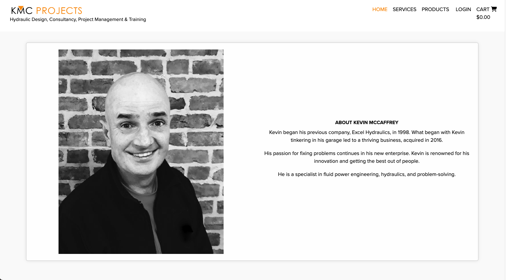

Also on the homepage there is an about section, giving some more details into the director of the company, providing trust with the users. 

The about section is responsive on mobile with the image of Kevin moving above the text for better UX.

### Navbar

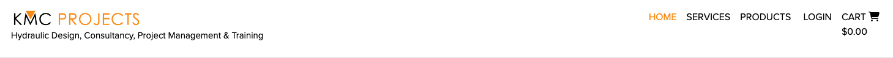

The nav bar is clean and simple, providing clear call to actions for users to access the site from. 
From the nav bar users can tell if they are logged in or not due to the changing navigation. 

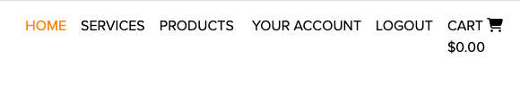

The nav bar is resposnive on mobile and reduces to a hamburger menu on smaller screen sizes.

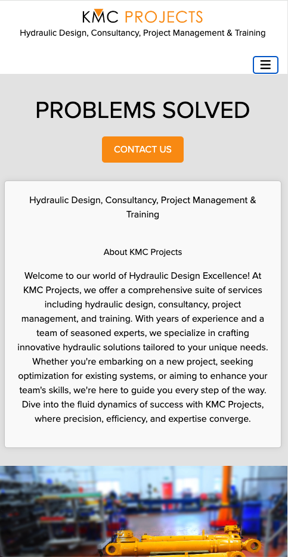

The hamburger opens clearly showing the call to actions. 

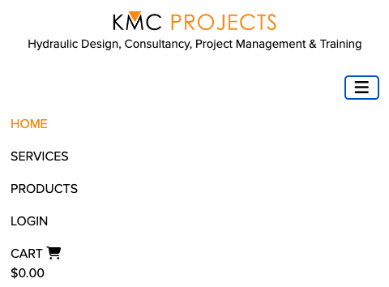

### Footer

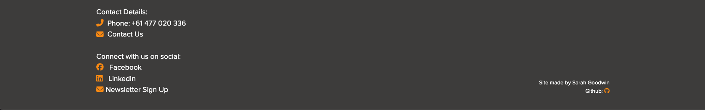

The footer has links to contact details, both the business phone number and the contact us form.

It has links to social media for KMC Project and/or Kevin McCaffrey the director.
It has a Newsletter sign up form for those who wish to be kept up to date with the business.

It has access to the site creator’s github.

### Services

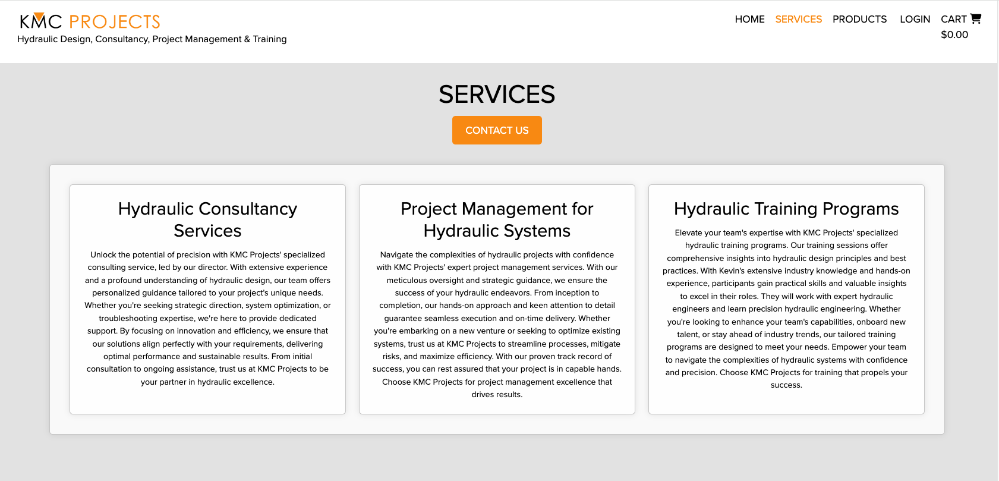

The services page gives users an idea of some of the services to discuss with KMC Projects in the contact form. It goes through 3 of their main offerings. 
- Hydraulic Consultancy Services
- Project Management for Hydraulic Systems
- Hydraulic Training Programs

For SEO these titles were changes from Consultancy, Project Management & Training. 

The price of these services has not been included as every service is bespoke to each client and the job specs must be discussed before a quote is offered.

### Case Study

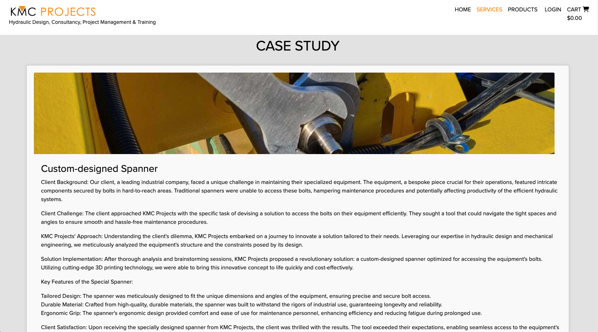

The case study showcases some of the work KMC Project is involved in, giving users an idea of the type of work they could expect if they were to become a clients. 

### Products

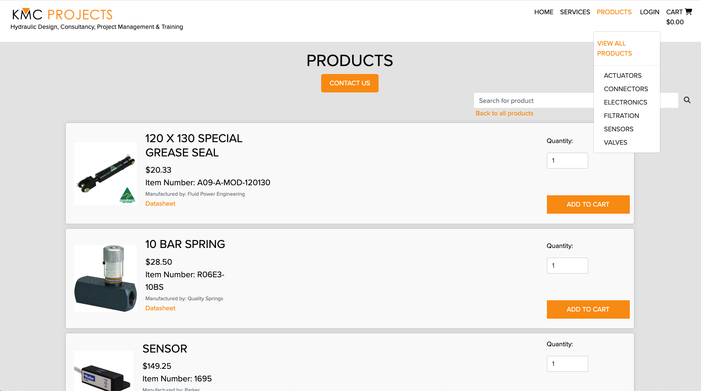

The products page has the option the view all products or to view by product type.
Users can search by product name or item number. When in discussions with Kevin from KMC Projects about the products page, he said his clients knew the item number they would be looking for and would not come to the site in search of a price or to browse types of an item. This is why the products page is clean and simple, just the way KMC Projects wanted it.

Users have the option to add the item to their carts, and choose how many items they wish to add. 
The products themselves list
- The name
- The price in NZD
- The item number which is unique to each item
- The manufacturer
- A datasheet pdf 

The products page is responsive and changes for mobile users

### Cart

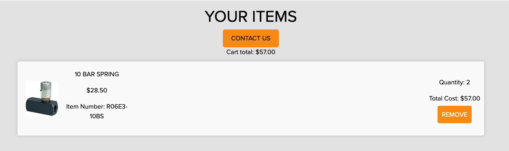

The cart page allows users to review and manage their selected items before proceeding to checkout. Users can easily view all items in their cart, and remove items if needed. After reviewing their selections, users can choose to continue shopping or proceed to checkout. 
This functionality provides users with control over their shopping experience, ensuring a smooth process from selection to purchase.

### Checkout

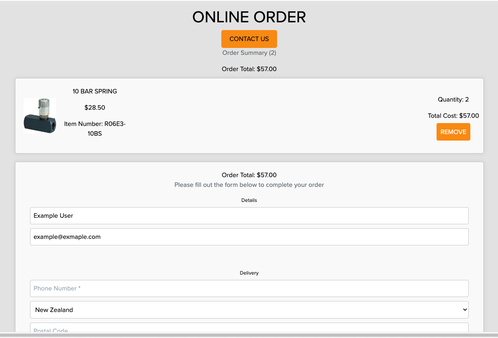

The checkout page is where users finalize their purchases. Users can review the items in their cart, remove any unwanted items, and view the total cost of their order. Users can input their delivery details, which if added from the account page will caryy across. 
Users can choose to save their delivery details, if they are not logged in they will be prompted to sign up or login if they use to save their details.

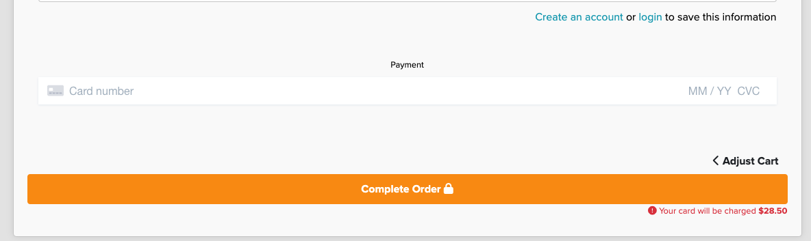

To complete the transaction, users can securely pay with their credit or debit card using the integrated Stripe payment gateway. 

### Login, Logout and Sign Up

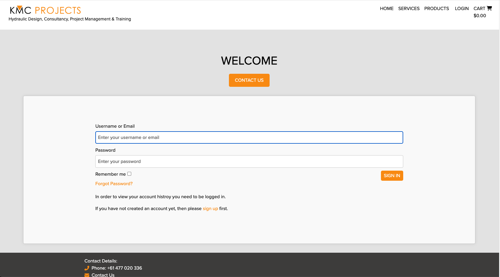

The login page provides users with a secure gateway to access their accounts. Users can enter their credentials, including their email address and password, to authenticate their identity. If incorrect credentials are entered, error messages will prompt users to retry, ensuring the security of their accounts.

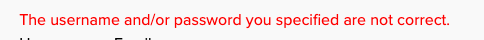

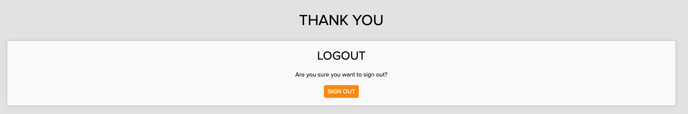

The logout page allows users to securely log out of their accounts. With a simple click, users can end their current session, ensuring the privacy and security of their account information.

### Forgot Password

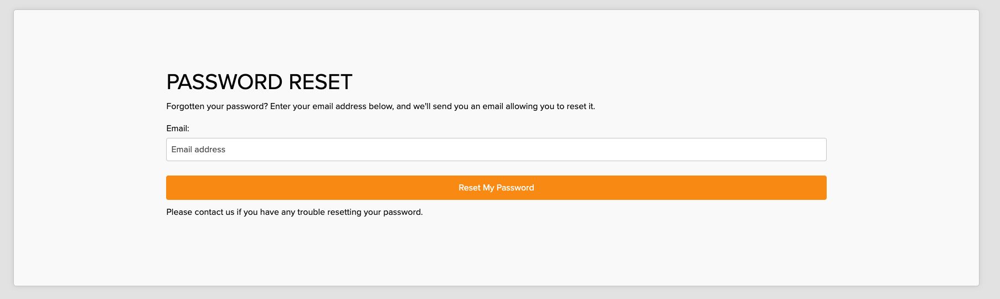

The forgot password page offers users a way to reset their passwords if forgotten. Users can enter their email address, and instructions for resetting their password will be sent to their inbox. 

### Register

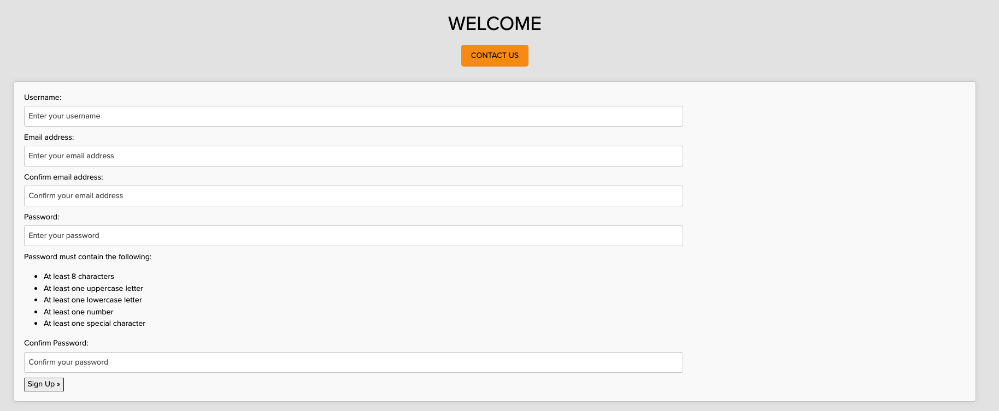

It offers them space for a username, password and then rechecks the password to ensure it matches and there were no errors.
An example of some of the errors:

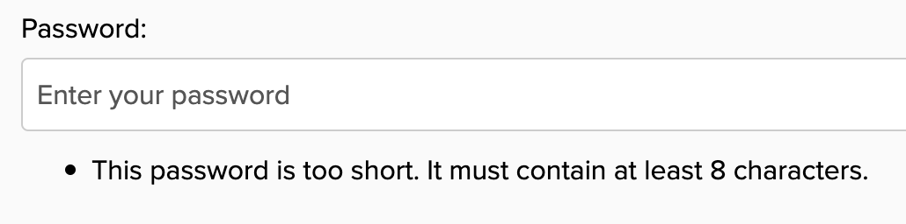

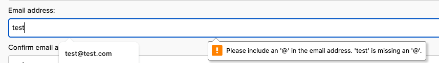

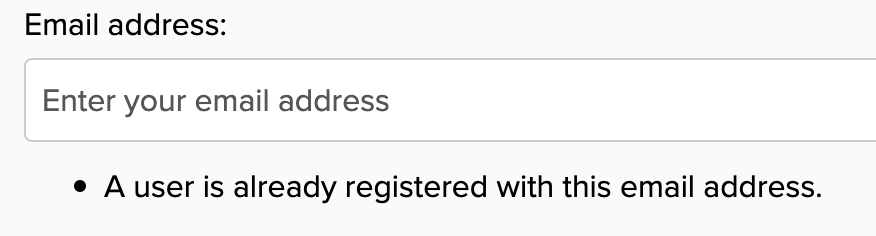

### Admin Access

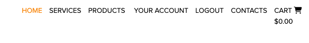

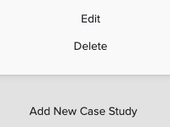

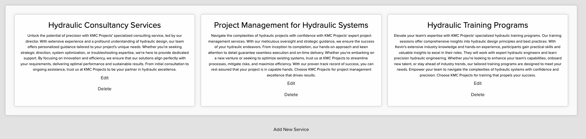

The admin superuser access allows admin users to create, read, update and delete both the services and case study sections of the site. Their nav bar also includes a contact list for people who have used the contact form.

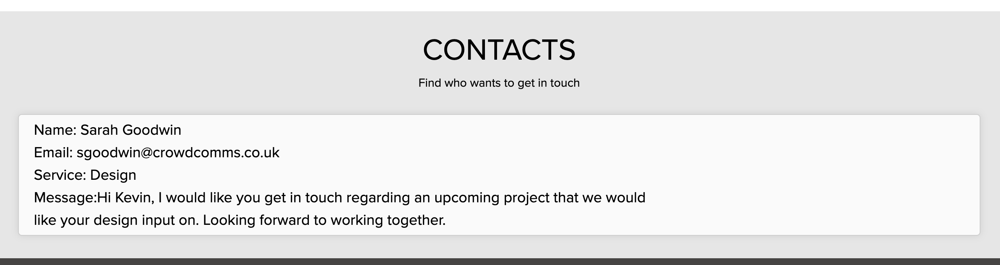

### Account

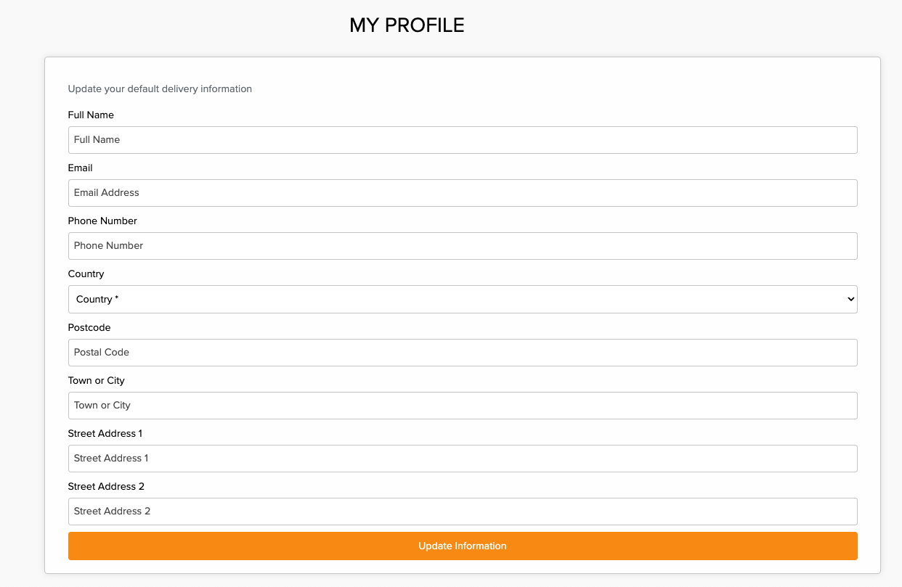

Users can save their delivery information on their account page and this will pull through to the orders page.
They will also be able to see their order history in a drop down list, showing the date they made the order and then the details.

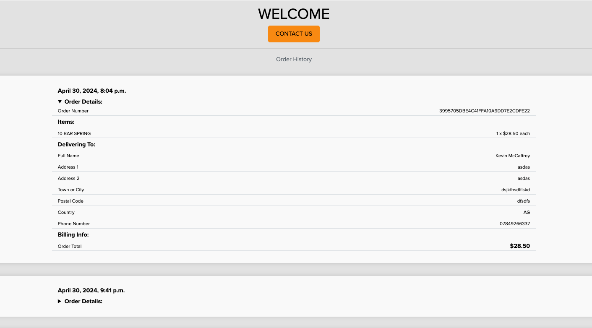

## Future Features

Future things to implement

* See who has singed up for the newsletter along with the contacts

* Add items for admin users from the frontend rather than the django admin panel

* Edit quantities from the cart page

[Back to Top](#kmc-projects)

# Technologies Used

- [Lucidchart](https://www.lucidchart.com/ "link to Lucidchart homepage")
Lucidchart was used to create the wireframe in the planning stages of the project
- [drawSQL](https://drawsql.app/ "Drawsql homepage")
Drawsql was used to create the data schema
- [GraphvizOnline](https://dreampuf.github.io/GraphvizOnline/ "GraphvizOnline website")
GraphvizOnline was used for the dot file converstion
- [HTML5](https://en.wikipedia.org/wiki/HTML5 "link to html5 wikipedia")
Used to create structure and content for the site.
- [CSS](https://www.w3.org/Style/CSS/Overview.en.html "link to w3")
Used to add custom styles to the site.
- [Django](https://www.djangoproject.com/ "link to django docs homepage")
The python framework used to develop the site.
- [Bootstrap](https://getbootstrap.com/ "link to bootstrap homepage")
The CSS framework used to add styles and structure to the site.
- [Python](https://en.wikipedia.org/wiki/Python_(programming_language) "link to Python wikipedia")
Used to provide functionality to the site.
- [AWS](https://aws.amazon.com/s3/ "link to aws homepage")
Used to host images for the site
- [Code Institute Postgres Database server](https://dbs.ci-dbs.net/ "Code Institute Postgres Database server")
Used to host the database used for the site.
- [Am I Responsive?](https://ui.dev/amiresponsive "Link to Am I responsive webpage")
Am I Responsive was used to see the responsive design and create screenshots of the final page on different devices.
- [Gitpod](https://www.gitpod.io/#get-started "Link to gitpod webpage")
Used to continue to create code and file structure for the respository.
- [GitHub](https://github.com/ "Link to github webpage")
GitHub was used to store the code files, README files and asset files after pushing
- [Heroku](https://id.heroku.com/login "Link to Heroku login")
Heroku was used to deploy the project. 

# Testing

Testing detail can be found [here](TESTING.md)

# Deployment

This project was developed on [GitPod](https://www.gitpod.io/ "link to gitpod homepage") 

The deployment steps were as follows:

### Creating a Heroku App

A Heroku app can be created on [Heroku website](https://id.heroku.com)

1. Click New to create a new app.

2. Give app a name and select closest region. When done, click Create app to confirm. Heroku app names must be unique.

### Connecting Database on Heroku

1. Open the Settings tab in the Heroku app

2. Add the config var DATABASE_URL, and for the value, copy in the database url from Code Institute Postgres Database server.

### Deployment to Heroku
1. In `settings.py` delete the database created and replace it with:

`if 'DATABASE_URL' in os.environ:
    DATABASES = {
     'default': dj_database_url.parse(os.environ.get('DATABASE_URL'))
    }
else:
    DATABASES = {
        'default': {
            'ENGINE': 'django.db.backends.sqlite3',
            'NAME': BASE_DIR / 'db.sqlite3',
        }
    }`

2. install webserver: `pip3 install gunicorn` - replaces the development server once the app is deployed to Heroku

3. run `pip3 freeze > requirements.txt` - creates a file to let heroku know which packages to install.

4. Create Procfile file

5. Add this code for Heroku to create web dyno: `web: gunicorn green_planet.wsgi:application`

6. Go to Heroku, settings , config var and add variable:
`COLLECTSTATIC` : 1 ,so that Heroku won't try to collect staticfiles when we deploy.

7. Add the hostname of the Heroku app to `ALLOWED_HOSTS` in settings.py

8. Push the code to Github

9. In the terminal run: `heroku git:remote -a heroku-app-name`

10. git push heroku main to deploy to heroku

### Connecting Heroku to Github

By connecting Heroku to Github the application will automatically deploy the latest code to Heroku.

1. In heroku app, open app, in "Deploy" tab, under the "Deployment method" setting select "GitHub"

2. Search for repository and click "Connect"

3. Choose "Enable Automatic Deploys"

### Config vars

Config vars are needed to be created in Heroku so that to conect the app to Django, AWS, stripe and email.

### Github

#### Create a new repository

- Log into [GitHub](https://github.com/)
- On the 'Repositories' tab click 'New'
- Name the repository and click 'Create repository'

#### Forking

- Sign into Github and go to my [repo](https://github.com/ChrisT-CC/H2B-PP5-ecommerce)
- Press the "Fork" button the top right corner of page
- Click "Create fork"

#### Cloning

- Sign in to Github and go to my [repo](https://github.com/ChrisT-CC/H2B-PP5-ecommerce)
- Above the list of files click "Code"
- Select HTTPS, SSH or Github CLI, then click the copy button to get the URL
- Open your IDE of choice
- Type "git clone" and then paste the URL you copied
- Press Enter

[Back to Top](#kmc-projects)

# Credits

## Content

Wording for the site was all created by Sarah Goodwin conjunction with Kevin McCaffrey, the owner of KMC Projects

### Images

Images were created in Canva, suppplied by the client or taken from google images.

### Code

Certain parts of the project were taken from the Boutique ado walkthrough project and stripe documentation. These have been clearly commented within the code.   

## Education

Additional learning:

- json:
https://codebeautify.org/blog/how-to-create-json-file/

- text editor:
https://www.youtube.com/watch?v=mF5jzSXb1dc

- choice fields
https://docs.djangoproject.com/en/5.0/ref/models/fields/
https://www.geeksforgeeks.org/how-to-align-checkboxes-and-their-labels-on-cross-browsers-using-css/

- Superusers
https://stackoverflow.com/questions/15998140/how-to-limit-a-view-to-superuser-only 

- Send emails
https://docs.djangoproject.com/en/5.0/topics/email/
https://simpleisbetterthancomplex.com/tutorial/2016/06/13/how-to-send-email.html
https://github.com/AnaMelisaGo/portfolio-5-green-planet/tree/1f5410657463b6c116d5fb6d87a9875348d427f8/checkout/templates/checkout/confirmation_emails

# Acknowledgements

- Mentor, Lauren-Nicole, for all her help and support, the useful resources she provided and for being a friendly face throughout! Could not have done this project without her!!
- Friends and family who helped test the site on different devices and give real world user feedback

[Back to Top](#kmc-projects)

