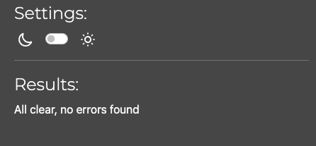

# KMC Projects Testing

Return to [README.md](README.md)

# Table of Contents

- [Code Validation](#code-validation)
  - [W3C HTML Validation Results](#w3c-html-validation-results)
  - [W3C CSS Validation Results](#w3c-css-validation-results)
  - [JSHint Validation Results](#jshint-validation-results)
  - [CI Python Linter Validation Results](#ci-python-linter-validation-results)
- [Manual Testing](#manual-testing)
  - [Cart App](#cart-app)
  - [Home App](#home-app)
  - [Items App](#items-app)
  - [Newsletter App](#newsletter-app)
  - [Orders App](#orders-app)
  - [Services App](#services-app)
  - [Users App](#users-app)
  - [KMCProjects App](#kmcprojects-app)
- [Other Testing](#other-testing)
- [Responsiveness Testing](#responsiveness-testing)
- [Browser Compatibility](#browser-compatibility)
- [User Testing](#user-testing)
  - [Things to Implement from User Testing](#things-to-implement-from-user-testing)
- [Accessibility Testing](#accessibility-testing)
  - [Lighthouse](#lighthouse)
- [Known Bugs](#known-bugs)
  - [Resolved](#resolved)
  - [Unresolved](#unresolved)

# Code Validation 

## W3C HTML Validation Results

All HTML code has been run through the [W3C HTML Validator](https://validator.w3.org/).

 W3C HTML Errors Found and fixed

After testing all errors were fixed and document checking complete was shown for all pages

| **TEMPLATE FILE** | **RUN THROUGH VALIDATOR** | **ANY ERRORS** | **ERRORS RESOLVED** |
| ----------------- | ------------------------- | --------------- | ------------------- |
| base.html         | yes                       | The type attribute is unnecessary for JavaScript resources. | yes                 |
| index.html        | yes                       | Error: Bad value tel: +61477020336 for attribute href on element a: Illegal character in scheme data: space is not allowed, Element br not allowed as child of element ul in this context.| yes  |
| contact_list.html | yes                       | no            | N/A  |
| contact.html      | yes                       | no              | N/A                 |
| cart.html         | yes                       | no             | N/A |
| items.html        | yes                       | no             | N/A        |
| newsletter.html   | yes                       | no              | N/A                 |
| orders.html       | yes                       | Attribute placeholder not allowed on element select at this point. |  |
| order_success.html| yes                       | no              | N/A                 |
| services.html     | yes                       | No p element in scope but a p end tag seen.|  |
| add_casestudy.html| yes                       | No p element in scope but a p end tag seen. | |
| delete_casestudy.html| yes                    | no              | N/A                 |
| edit_casestudy.html| yes                      | No p element in scope but a p end tag seen. | |
| add_service.html  | yes                       | no              | N/A                 |
| delete_service.html| yes                     | no              | N/A                 |
| edit_service.html | yes                      | no              | N/A                 |
| users.html        | yes                       | Duplicate attribute class, Attribute placeholder not allowed on element select at this point | yes                |
| login.html        | yes                       | no              | N/A                 |
| signup.html       | yes                       | End tag p implied, but there were open elements, Unclosed element span, Stray end tag span, No p element in scope but a p end tag seen.| changed form from {{ form.as_p }} to manually edit |
| password_reset.html| yes                      |  Trailing slash on void elements has no effect and interacts badly with unquoted attribute values| yes|

## W3C CSS Validation Results

All custom CSS has been run through the [W3C CSS Validator](https://jigsaw.w3.org/css-validator/ "jigsaw w3 page")

No errors were found when running CSS through w3c validator

## JSHint Validation Results

No javascript was written by Sarah Goodwin for this project, all javascript that has been included is credited to stripe and the Boutquie Ado project

## CI Python Linter Validation Results

All python code that was written for this project by Sarah Goodwin was developed following PEP8 guidelines and was run through the [CI Python Linter](https://pep8ci.herokuapp.com/ "ci python linter page")

 Cart App 

| **Python file** | **RUN THROUGH VALIDATOR** | **ANY ERRORS** | **ERRORS RESOLVED** |
| --------------- | -------------------------- | --------------- | ------------------- |
| context.py      | yes | expected 2 blank lines, found 1, blank line contains whitespace, no newline at end of file | yes |
| urls.py         | yes |no newline at end of file | yes |
| views.py        | yes |expected 2 blank lines, found 1, no newline at end of file | yes |

 Home App 

| **Python file** | **RUN THROUGH VALIDATOR** | **ANY ERRORS** | **ERRORS RESOLVED** |
| --------------- | -------------------------- | --------------- | ------------------- |
| admin.py        | Yes                        | no | N/A |
| forms.py        | Yes                        | line too long (83 > 79 characters)| Added # noqa and all clear |
| models.py       | Yes                        | line too long (83 > 79 characters)| Added # noqa and all clear |
| urls.py         | Yes                        |no | N/A |
| views.py        | Yes                        |blank line contains whitespace | yes |

 Items App 

| **Python file** | **RUN THROUGH VALIDATOR** | **ANY ERRORS** | **ERRORS RESOLVED** |
| --------------- | -------------------------- | --------------- | ------------------- |
| admin.py        | Yes                        |no | N/A |
| forms.py        | Yes                        | no | N/A |
| models.py       | Yes                        | line too long (83 > 79 characters)| Added # noqa and all clear |
| urls.py         | Yes                        |no | N/A |
| views.py        | Yes                        | trailing whitespace, line too long (83 > 79 characters) | yes |

 Newsletter App 

| **Python file** | **RUN THROUGH VALIDATOR** | **ANY ERRORS**       | **ERRORS RESOLVED**   |
| --------------- | -------------------------- | --------------------- | --------------------- |
| admin.py        | Yes                        |no | N/A |
| forms.py        | Yes                        | Line too long (89 > 79 characters) | Added # noqa and all clear |
| models.py       | Yes                        | no | N/A |
| urls.py         | Yes                        | no | N/A |
| views.py        | Yes                        | expected 2 blank lines, found 1, line too long (83 > 79 characters), line too long (85 > 79 characters), trailing whitespace | yes |

 Orders App 

| **Python file** | **RUN THROUGH VALIDATOR** | **ANY ERRORS** | **ERRORS RESOLVED** |
| --------------- | -------------------------- | --------------- | ------------------- |
| admin.py        | Yes                        | expected 2 blank lines, found 1, continuation line under-indented for visual indent, line too long (83 > 79 characters)| yes|
| forms.py        | Yes                        |trailing whitespace |yes |
| models.py       | Yes                        |E501 line too long (various lengths)| Added # noqa and all clear |
| urls.py         | Yes                        |line too long (89 > 79 characters)| Added # noqa and all clear |
| views.py        | Yes                        | E501 line too long (various lengths)| Added # noqa and all clear |
| signals.py      | Yes                        |trailing whitespace |yes |

 Services App 

| **Python file** | **RUN THROUGH VALIDATOR** | **ANY ERRORS** | **ERRORS RESOLVED** |
| --------------- | -------------------------- | --------------- | ------------------- |
| admin.py        | Yes                        |no | N/A |
| forms.py        | Yes                        | no | N/A |
| models.py       | Yes                        | no | N/A |
| urls.py         | Yes                        |E501 line too long (various lengths)| Added # noqa and all clear |
| views.py        | Yes                        | E501 line too long (various lengths)| Added # noqa and all clear |

 Users App 

| **Python file** | **RUN THROUGH VALIDATOR** | **ANY ERRORS** | **ERRORS RESOLVED** |
| --------------- | -------------------------- | --------------- | ------------------- |
| admin.py        | Yes                        | trailing whitespace,  expected 2 blank lines, found 1 | yes |
| forms.py        | Yes                        |E501 line too long (various lengths)| Added # noqa and all clear |
| models.py       | Yes                        |no | N/A |
| urls.py         | Yes                        | no | N/A |
| views.py        | Yes                        | no | N/A |

 KMCProjects App 

| **Python file** | **RUN THROUGH VALIDATOR** | **ANY ERRORS** | **ERRORS RESOLVED** |
| --------------- | -------------------------- | --------------- | ------------------- |
| settings.py     | Yes                        | Line too long (89 > 79 characters), line too long (91 > 79 characters) | Added # noqa and all clear |
| views.py        | Yes                        |expected 2 blank lines, found 1 | yes |

Final testing showed:

# Manual Testing

 Cart App 

| **TEST** | **ACTION** | **EXPECTATION** | **RESULT** | **FIX** |
| -------- | ---------- | --------------- | -----------| ------- |
| Cart page|Opened site url	| items appearing in cart |Worked as expected | N/A|
|No item| |                 |            |         |
|Remove Item|            |                 |            |         |
| Checkout button|            |                 |            |         |
| Keep shopping button|            |                 |            |         |

 Home App 

| **TEST** | **ACTION** | **EXPECTATION** | **RESULT** | **FIX** |
| -------- | ---------- | --------------- | -----------| ------- |
|          |            |                 |            |         |
|          |            |                 |            |         |
|          |            |                 |            |         |
|          |            |                 |            |         |
|          |            |                 |            |         |

 Items App 

| **TEST** | **ACTION** | **EXPECTATION** | **RESULT** | **FIX** |
| -------- | ---------- | --------------- | -----------| ------- |
|          |            |                 |            |         |
|          |            |                 |            |         |
|          |            |                 |            |         |
|          |            |                 |            |         |
|          |            |                 |            |         |

 Newsletter App 

| **TEST** | **ACTION** | **EXPECTATION** | **RESULT** | **FIX** |
| -------- | ---------- | --------------- | -----------| ------- |
|          |            |                 |            |         |
|          |            |                 |            |         |
|          |            |                 |            |         |
|          |            |                 |            |         |
|          |            |                 |            |         |

 Orders App 

| **TEST** | **ACTION** | **EXPECTATION** | **RESULT** | **FIX** |
| -------- | ---------- | --------------- | -----------| ------- |
|          |            |                 |            |         |
|          |            |                 |            |         |
|          |            |                 |            |         |
|          |            |                 |            |         |
|          |            |                 |            |         |

 Services App 

| **TEST** | **ACTION** | **EXPECTATION** | **RESULT** | **FIX** |
| -------- | ---------- | --------------- | -----------| ------- |
|          |            |                 |            |         |
|          |            |                 |            |         |
|          |            |                 |            |         |
|          |            |                 |            |         |
|          |            |                 |            |         |

 Users App 

| **TEST** | **ACTION** | **EXPECTATION** | **RESULT** | **FIX** |
| -------- | ---------- | --------------- | -----------| ------- |
|          |            |                 |            |         |
|          |            |                 |            |         |
|          |            |                 |            |         |
|          |            |                 |            |         |
|          |            |                 |            |         |

 KMCProjects App 

| **TEST** | **ACTION** | **EXPECTATION** | **RESULT** | **FIX** |
| -------- | ---------- | --------------- | -----------| ------- |
|          |            |                 |            |         |
|          |            |                 |            |         |
|          |            |                 |            |         |
|          |            |                 |            |         |
|          |            |                 |            |         |

## Other Testing

| **TEST** | **ACTION** | **EXPECTATION** | **RESULT** | **FIX** |
| -------- | ---------- | --------------- | -----------| ------- |
| 404 Error |  |  |  |  |
| URL Access |  |  |  |  |
| URL Access |  |  |  |  |

## Responsiveness testing

| **DEVICE** | **ACTION** | **EXPECTATION** | **RESULT** | **FIX** |
| -------- | ---------- | --------------- | -----------| ------- |
| Samsung22 Ultra | Tested site on mobile | Site functions and is responsive | Worked as expected | N/A |
| iPhone 15 | Tested site on mobile | Site functions and is responsive | Worked as expected | N/A |
| Dev Tools for iPad | Tested site for iPad Pro via dev tools | Site functions and is responsive | Worked as expected | N/A |

## Browser Compatibility

The site was tested on the following browser types

* Google Chrome
* Microsoft Edge
* Safari

## User Testing

A user testing form was sent to friends and family to test the site on their devices and get real world feedback from people who had not been involved in the creation of the site.

Here is the form that was sent.

Feedback from the form

* Better responsiveness for mobile - added media queries after this feedback
* User testing did not throw many errors as users followed instructions
* Users found it easy to add, edit, and delete a swim
* Users found it easy to create an account and navigate the website 

### Things to implement from user testing

* User reported that "I put in a non matching password and it didn't warn me" so password errors were added to form to ensure this cannot happen

* User reported "Had a problem with the time field. Would be good to know the format it was looking for." so placeholder text was added

* User reported "It would be good if errors popped up in a different colour. I entered something incorrectly when creating an account and it took me a second to notice because it was the same colour font" - this would be a good feature for future implementation 

# Accessibility Testing

## Lighthouse

Google Lighthouse test from the dev tools was used to test the pages on the site for 

* Performance
* Accessibility
* Best Practices
* SEO

Examples of results are as follows:

 Home 

 Services 

 Products 

 Your Account 

 Login and Logout 

 Cart 

# Known Bugs

## Resolved

## Unresolved 

No known unresolved bugs

Return to [README.md](README.md)