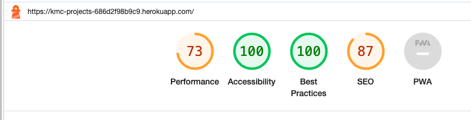

# KMC Projects Testing

Return to [README.md](README.md)

# Table of Contents

- [Code Validation](#code-validation)
  - [W3C HTML Validation Results](#w3c-html-validation-results)
  - [W3C CSS Validation Results](#w3c-css-validation-results)
  - [JSHint Validation Results](#jshint-validation-results)
  - [CI Python Linter Validation Results](#ci-python-linter-validation-results)
- [Manual Testing](#manual-testing)
  - [Cart App](#cart-app)
  - [Home App](#home-app)
  - [Items App](#items-app)
  - [Newsletter App](#newsletter-app)
  - [Orders App](#orders-app)
  - [Services App](#services-app)
  - [Users App](#users-app)
  - [KMCProjects App](#kmcprojects-app)
- [Other Testing](#other-testing)
- [Responsiveness Testing](#responsiveness-testing)
- [Browser Compatibility](#browser-compatibility)
- [User Testing](#user-testing)
- [Accessibility Testing](#accessibility-testing)
  - [Lighthouse](#lighthouse)
- [Known Bugs](#known-bugs)
  - [Resolved](#resolved)
  - [Unresolved](#unresolved)

# Code Validation 

## W3C HTML Validation Results

All HTML code has been run through the [W3C HTML Validator](https://validator.w3.org/).

 W3C HTML Errors Found 

After testing, all errors that were able to be fixed were resolved, due to the use of the |safe filter one error remains. See [Known Bugs](#known-bugs) for details.

| **TEMPLATE FILE** | **RUN THROUGH VALIDATOR** | **ANY ERRORS** | **ERRORS RESOLVED** |
| ----------------- | ------------------------- | --------------- | ------------------- |
| base.html         | yes                       | The type attribute is unnecessary for JavaScript resources. | yes                 |
| index.html        | yes                       | Error: Bad value tel: +61477020336 for attribute href on element a: Illegal character in scheme data: space is not allowed, Element br not allowed as child of element ul in this context.| yes  |
| contact_list.html | yes                       | no            | N/A  |
| contact.html      | yes                       | no              | N/A                 |
| cart.html         | yes                       | no             | N/A |
| items.html        | yes                       | no             | N/A        |
| newsletter.html   | yes                       | no              | N/A                 |
| orders.html       | yes                       | Attribute placeholder not allowed on element select at this point. |  |
| order_success.html| yes                       | no              | N/A                 |
| services.html     | yes                       | No p element in scope but a p end tag seen.| No, details below in [unresolved](#unresolved)|
| add_casestudy.html| yes                       | No p element in scope but a p end tag seen. |No, details below in [unresolved](#unresolved)|
| delete_casestudy.html| yes                    | no              | N/A                 |
| edit_casestudy.html| yes                      | No p element in scope but a p end tag seen. |No, details below in [unresolved](#unresolved)|
| add_service.html  | yes                       | no              | N/A                 |
| delete_service.html| yes                     | no              | N/A                 |
| edit_service.html | yes                      | no              | N/A                 |
| users.html        | yes                       | Duplicate attribute class, Attribute placeholder not allowed on element select at this point | yes                |
| login.html        | yes                       | no              | N/A                 |
| signup.html       | yes                       | End tag p implied, but there were open elements, Unclosed element span, Stray end tag span, No p element in scope but a p end tag seen.| changed form from {{ form.as_p }} to manually edit |
| password_reset.html| yes                      |  Trailing slash on void elements has no effect and interacts badly with unquoted attribute values| yes|

## W3C CSS Validation Results

All custom CSS has been run through the [W3C CSS Validator](https://jigsaw.w3.org/css-validator/ "jigsaw w3 page")

No errors were found when running CSS through w3c validator

## JSHint Validation Results

No javascript was written by Sarah Goodwin for this project, all javascript that has been included is credited to stripe and the Boutquie Ado project

## CI Python Linter Validation Results

All python code that was written for this project by Sarah Goodwin was developed following PEP8 guidelines and was run through the [CI Python Linter](https://pep8ci.herokuapp.com/ "ci python linter page")

 Cart App 

| **Python file** | **RUN THROUGH VALIDATOR** | **ANY ERRORS** | **ERRORS RESOLVED** |
| --------------- | -------------------------- | --------------- | ------------------- |
| context.py      | yes | expected 2 blank lines, found 1, blank line contains whitespace, no newline at end of file | yes |
| urls.py         | yes |no newline at end of file | yes |
| views.py        | yes |expected 2 blank lines, found 1, no newline at end of file | yes |

 Home App 

| **Python file** | **RUN THROUGH VALIDATOR** | **ANY ERRORS** | **ERRORS RESOLVED** |
| --------------- | -------------------------- | --------------- | ------------------- |
| admin.py        | Yes                        | no | N/A |
| forms.py        | Yes                        | line too long (83 > 79 characters)| Added # noqa and all clear |
| models.py       | Yes                        | line too long (83 > 79 characters)| Added # noqa and all clear |
| urls.py         | Yes                        |no | N/A |
| views.py        | Yes                        |blank line contains whitespace | yes |

 Items App 

| **Python file** | **RUN THROUGH VALIDATOR** | **ANY ERRORS** | **ERRORS RESOLVED** |
| --------------- | -------------------------- | --------------- | ------------------- |
| admin.py        | Yes                        |no | N/A |
| forms.py        | Yes                        | no | N/A |
| models.py       | Yes                        | line too long (83 > 79 characters)| Added # noqa and all clear |
| urls.py         | Yes                        |no | N/A |
| views.py        | Yes                        | trailing whitespace, line too long (83 > 79 characters) | yes |

 Newsletter App 

| **Python file** | **RUN THROUGH VALIDATOR** | **ANY ERRORS**       | **ERRORS RESOLVED**   |
| --------------- | -------------------------- | --------------------- | --------------------- |
| admin.py        | Yes                        |no | N/A |
| forms.py        | Yes                        | Line too long (89 > 79 characters) | Added # noqa and all clear |
| models.py       | Yes                        | no | N/A |
| urls.py         | Yes                        | no | N/A |
| views.py        | Yes                        | expected 2 blank lines, found 1, line too long (83 > 79 characters), line too long (85 > 79 characters), trailing whitespace | yes |

 Orders App 

| **Python file** | **RUN THROUGH VALIDATOR** | **ANY ERRORS** | **ERRORS RESOLVED** |
| --------------- | -------------------------- | --------------- | ------------------- |
| admin.py        | Yes                        | expected 2 blank lines, found 1, continuation line under-indented for visual indent, line too long (83 > 79 characters)| yes|
| forms.py        | Yes                        |trailing whitespace |yes |
| models.py       | Yes                        |E501 line too long (various lengths)| Added # noqa and all clear |
| urls.py         | Yes                        |line too long (89 > 79 characters)| Added # noqa and all clear |
| views.py        | Yes                        | E501 line too long (various lengths)| Added # noqa and all clear |
| signals.py      | Yes                        |trailing whitespace |yes |

 Services App 

| **Python file** | **RUN THROUGH VALIDATOR** | **ANY ERRORS** | **ERRORS RESOLVED** |
| --------------- | -------------------------- | --------------- | ------------------- |
| admin.py        | Yes                        |no | N/A |
| forms.py        | Yes                        | no | N/A |
| models.py       | Yes                        | no | N/A |
| urls.py         | Yes                        |E501 line too long (various lengths)| Added # noqa and all clear |
| views.py        | Yes                        | E501 line too long (various lengths)| Added # noqa and all clear |

 Users App 

| **Python file** | **RUN THROUGH VALIDATOR** | **ANY ERRORS** | **ERRORS RESOLVED** |
| --------------- | -------------------------- | --------------- | ------------------- |
| admin.py        | Yes                        | trailing whitespace,  expected 2 blank lines, found 1 | yes |
| forms.py        | Yes                        |E501 line too long (various lengths)| Added # noqa and all clear |
| models.py       | Yes                        |no | N/A |
| urls.py         | Yes                        | no | N/A |
| views.py        | Yes                        | no | N/A |

 KMCProjects App 

| **Python file** | **RUN THROUGH VALIDATOR** | **ANY ERRORS** | **ERRORS RESOLVED** |
| --------------- | -------------------------- | --------------- | ------------------- |
| settings.py     | Yes                        | Line too long (89 > 79 characters), line too long (91 > 79 characters) | Added # noqa and all clear |
| views.py        | Yes                        |expected 2 blank lines, found 1 | yes |

Final testing showed:

# Manual Testing

 Cart App 

| **TEST** | **ACTION** | **EXPECTATION** | **RESULT** | **FIX** |
| -------- | ---------- | --------------- | -----------| ------- |
| Cart page|Opened site url	| items appearing in cart |Worked as expected | N/A|
|No item| No item added | No items to show in car | Message saying "Your cart is empty." | N/A |
|Remove Item| Click remove button | Item removed from cart | Message saying "Item remove from your cart" | N/A |
| Checkout button| Click checkout button | Get taken to checkout page |Redirected to checkout page | N/A|
| Keep shopping button| Click Keep shopping button | Get taken to prodcuts page | Redirected to products page | N/A |

 Home App 

| **TEST**           | **ACTION**                                    | **EXPECTATION**                             | **RESULT**            | **FIX**            |
| ------------------ | --------------------------------------------- | --------------------------------------------| ----------------------| ------------------ |
| Navigation         | Clicked on the Home link in the navigation menu | Redirected to the home page                | Redirected as expected | N/A             |
| Homepage content   | Scrolled through the homepage                 | See comapny bio and about           | Content displayed correctly | N/A             |
| Contact Us link    | Clicked on the "Contact Us" link              | Redirected to the contact page              | Redirected as expected | N/A             |
| Social media links | Clicked on social media icons                 | Redirected to respective social media profiles | Redirected as expected | N/A            |
| Footer navigation  | Clicked on phone link in the footer                | web phone app opened           | Redirected as expected | N/A             |

 Items App 

| **TEST**           | **ACTION**                                    | **EXPECTATION**                             | **RESULT**            | **FIX**            |
| ------------------ | --------------------------------------------- | --------------------------------------------| ----------------------| ------------------ |
| Item display       | Accessed the items page                       | Items displayed in a list    | Items displayed correctly | N/A             |
| Search function    | Searched for specific item by name                  | Relevant items matching the search query shown | Search results displayed | N/A          |
| Add to cart        | Clicked on "Add to Cart" button for an item   | Item added to the cart                      | Item successfully added | N/A             |

 Newsletter App 

| **TEST**           | **ACTION**                                    | **EXPECTATION**                             | **RESULT**            | **FIX**            |
| ------------------ | --------------------------------------------- | --------------------------------------------| ----------------------| ------------------ |
| Subscription form | Entered email and clicked "Submit" button  | Confirmation message displayed               | Subscription successful | N/A             |
| Email validation  | Entered invalid email format in subscription form | Error message displayed                 | Error message shown    | N/A             |

 Orders App 

| **TEST**           | **ACTION**                                    | **EXPECTATION**                             | **RESULT**            | **FIX**            |
| ------------------ | --------------------------------------------- | --------------------------------------------| ----------------------| ------------------ |
| Order placement    | Added items to cart and proceeded to checkout | Order confirmation page displayed           | Order placed successfully | N/A           |
| Order details      | Viewed details of a specific order            | Detailed information about the order shown   | Details displayed correctly | N/A          |
| Delviery details     | Added delviery details           | Detailed information added to order   | Details displayed correctly | N/A          |

 Services App 

| **TEST**           | **ACTION**                                    | **EXPECTATION**                             | **RESULT**            | **FIX**            |
| ------------------ | --------------------------------------------- | --------------------------------------------| ----------------------| ------------------ |
| Service offerings  | View list of services          | Services displayed    | Services listed correctly | N/A         |
| Edit service details as admin    | Clicked to edit a service  | Detailed information about the service shown and able to amke edit | Edit successful | N/A       |
| Add new service as admin    | Clicked to add a service  | Able to add service details | New Service added successful | N/A       |
| Delete service details as admin    | Clicked to delete a service  | Delete check message shown | Delete successful | N/A       |
| Case study view  | View case study          | Case Study displayed    | Case study listed correctly | N/A         |
| Edit case study details as admin    | Clicked to edit a case study  | Detailed information about the case study shown and able to make edit | Edit successful | N/A       |
| Add new case study as admin    | Clicked to add a case study  | Able to add case study details | New case study added successful | N/A       |
| Delete case study details as admin    | Clicked to case study a service  | Delete check message shown | Delete successful | N/A       |

 Users App 

| **TEST**           | **ACTION**                                    | **EXPECTATION**                             | **RESULT**            | **FIX**            |
| ------------------ | --------------------------------------------- | --------------------------------------------| ----------------------| ------------------ |
| User registration | Signed up for an account                      | Account created successfully                | Account created       | N/A             |
| User login         | Logged in with registered credentials         | Logged in to user account                    | Login successful      | N/A             |
| User Account      | Accessed user account page                     | Personal information and settings displayed | Profile displayed correctly | N/A     |
| Password reset    | Reset password using "Forgot Password" link   | Password reset confirmation received         | Password reset successful | N/A         |
| Account inormation upadte  | Updated account information   | Changes reflected in order infromation    | Account updated      | N/A             |
| View order histroy | Created order and view it in account  | See order details    | Can see order successfully      | N/A             |

## Other Testing

| **TEST** | **ACTION** | **EXPECTATION** | **RESULT** | **FIX** |
| -------- | ---------- | --------------- | -----------| ------- |
| 404 Error |Typed /hello at end of url | 404 error page to show | Worked as expected | N/A |
| URL Access |Typed /services/add at end of url | 404 error page to show | Taken back to login page | N/A |
| URL Access | Typed /contact/list at end of url | 404 error page to show | was able to login page | add user test to view |

## Responsiveness testing

| **DEVICE** | **ACTION** | **EXPECTATION** | **RESULT** | **FIX** |
| -------- | ---------- | --------------- | -----------| ------- |
| Samsung22 Ultra | Tested site on mobile | Site functions and is responsive | Worked as expected | N/A |
| iPhone 15 | Tested site on mobile | Site functions and is responsive | Worked as expected | N/A |
| Dev Tools for iPad | Tested site for iPad Pro via dev tools | Site functions and is responsive | Worked as expected | N/A |

## Browser Compatibility

The site was tested on the following browser types

* Google Chrome
* Microsoft Edge
* Safari

## User Testing

A user testing form was sent to friends and family to test the site on their devices and get real world feedback from people who had not been involved in the creation of the site.

Feedback from the form

* Better responsiveness for mobile - added media queries after this feedback
* User testing did not throw many errors as users found site easy to use
* Users found it easy to add, edit, and delete a service and case study when given admin credentials
* Users found it easy to create an account and navigate the website 
* Users found it easy to add item to cart and proceed with checkout

# Accessibility Testing

## Lighthouse

Google Lighthouse test from the dev tools was used to test the pages on the site for 

* Performance
* Accessibility
* Best Practices
* SEO

Examples of results are as follows:

 Home 

 Services 

 Items 

 Your Account 

 Login and Logout 

 Cart 

## P Element Error

The extra p tag is coming from the |safe filter. By using the safe filter in casestudy.body, it is allowing Django to trust that the HTML content is safe and should be rendered as-is, without escaping it. This allows the HTML content to be rendered with its intended formatting and styling on the webpage.

## Placeholder error
The error occured because the <select> elements in HTML do not support the placeholder attribute.

## Resolved

By removing country from the placeholders in the __init__ method and checking if the field is country, it will be skipped in the logic. 
The piece of code `if field != 'country':` was added in so solve this bug. 

## Unresolved 

If the |safe filter is removed then the formatting from the rich body text editor is also removed and the below happens. As this is needed for the site for admin users to be able to edit and format the text. it has been left in and the error noted.

Return to [README.md](README.md)

# Known Bugs

At time of submission

## P Element Error

The extra p tag is coming from the |safe filter. By using the safe filter in casestudy.body, it is allowing Django to trust that the HTML content is safe and should be rendered as-is, without escaping it. This allows the HTML content to be rendered with its intended formatting and styling on the webpage.

## Placeholder error
The error occured because the <select> elements in HTML do not support the placeholder attribute.

## Resolved

By removing country from the placeholders in the __init__ method and checking if the field is country, it will be skipped in the logic. 
The piece of code `if field != 'country':` was added in so solve this bug. 

## Unresolved 

If the |safe filter is removed then the formatting from the rich body text editor is also removed and the below happens. As this is needed for the site for admin users to be able to edit and format the text. it has been left in and the error noted.

Return to [README.md](README.md)
